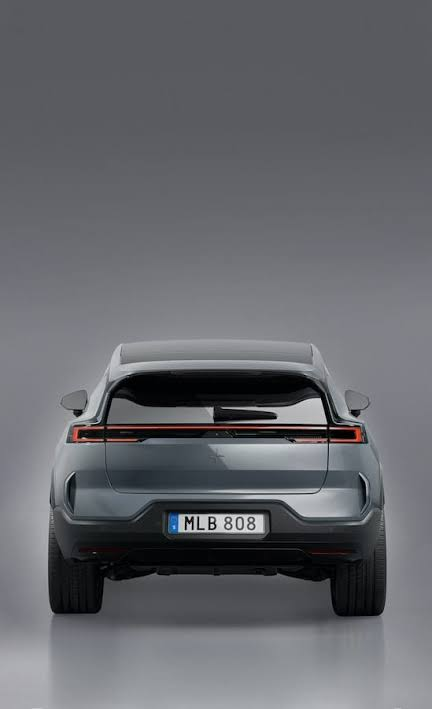
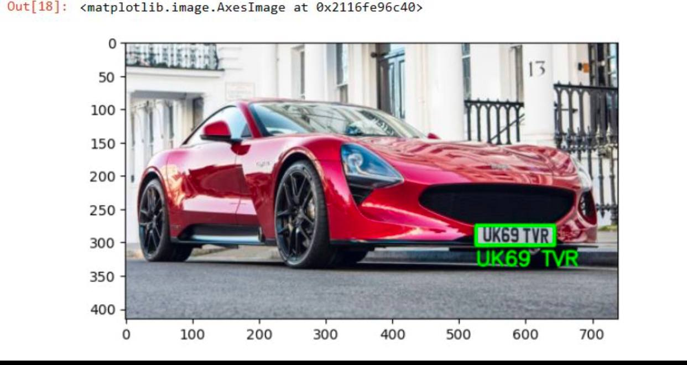
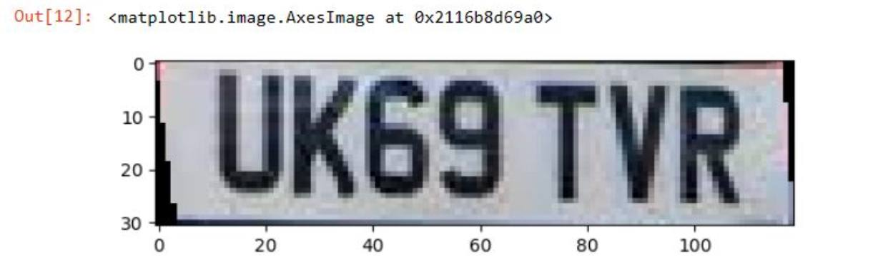

# 🚗 Automatic License Plate Recognition using OCR

## 📌 Overview

This project implements an **Automatic License Plate Recognition (ALPR)** system using **Computer Vision** and **Optical Character Recognition (OCR)** techniques.

The system detects a vehicle's license plate from an image, extracts the plate region, and recognizes the plate number using **EasyOCR**.

---

## 🎯 Objective

The main objective of this project is to automatically detect and recognize vehicle license plates from images using OpenCV and OCR techniques.

---

## 📊 Project Workflow

1. Read the input vehicle image.
2. Convert the image to grayscale.
3. Apply bilateral filtering for noise reduction.
4. Detect edges using the Canny Edge Detector.
5. Find contours and locate the license plate.
6. Crop the detected license plate.
7. Recognize the plate text using EasyOCR.
8. Display the detected plate and the recognized text.

---

## 🖼️ Results

### Original Vehicle Images

#### Vehicle Image 1


#### Vehicle Image 2



---

### License Plate Detection



---

### OCR Result



The system successfully detects the vehicle's license plate and recognizes the license number using EasyOCR.

---

## 🛠️ Technologies Used

- Python
- OpenCV
- EasyOCR
- NumPy
- Matplotlib
- Imutils

---

## 📦 Required Libraries

```bash
pip install opencv-python
pip install easyocr
pip install imutils
pip install matplotlib
pip install numpy
```

---

## ▶️ How to Run

```bash
git clone https://github.com/Meriam-aziz/Vehicle-License-Plate-Recognition-using-OCR.git

cd Vehicle-License-Plate-Recognition-using-OCR

pip install -r requirements.txt

jupyter notebook OCR.ipynb
```

---

## 📁 Project Structure

```text
Vehicle-License-Plate-Recognition-using-OCR/
│
├── images/
│   ├── car1.png.jpeg
│   ├── car2.png.jpeg
│   ├── detection_result.png.jpg
│   └── ocr_result.png.jpg
│
├── OCR.ipynb
├── README.md
└── requirements.txt
```

---

## 🚀 Features

- Automatic vehicle license plate detection.
- Image preprocessing using OpenCV.
- Text extraction using EasyOCR.
- Fast and accurate OCR pipeline.
- Works with different vehicle images.

---

## 👩‍💻 Author

**Meriam Aziz**

---

## ⭐ Future Improvements

- Support real-time video processing.
- Improve detection accuracy under different lighting conditions.
- Detect multiple license plates in one image.
- Deploy the project as a web application using Streamlit or Flask.

